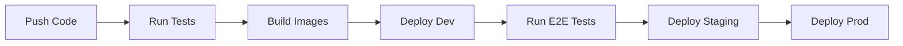

# Platform One - Internal Developer Platform

<div align="center">

[](https://github.com/your-org/platform-one/actions)
[](LICENSE)
[](https://www.typescriptlang.org/)
[](https://reactjs.org/)
[](https://nodejs.org/)

A comprehensive internal developer platform for service management, monitoring, and deployment automation.

[Live Demo](https://demo.platform-one.io) • [Documentation](docs/) • [API Reference](docs/api/)

</div>

## 📑 Table of Contents

- [Project Structure](#-project-structure)
- [Features](#-features)
- [Quick Start](#-quick-start)
- [Architecture](#-architecture)
- [Deployment](#-deployment)
- [Development](#-development)
- [Contributing](#-contributing)

## 🗂 Project Structure

```bash
platform-one/
├── apps/
│   ├── frontend/                    # React Frontend Application
│   │   ├── src/
│   │   │   ├── components/         # Reusable UI components
│   │   │   │   ├── common/        # Generic components
│   │   │   │   ├── layout/        # Layout components
│   │   │   │   └── ui/           # Basic UI elements
│   │   │   ├── features/          # Feature-specific modules
│   │   │   │   ├── services/     # Service management
│   │   │   │   ├── monitoring/   # Monitoring dashboards
│   │   │   │   ├── deployments/  # Deployment management
│   │   │   │   └── settings/     # Platform settings
│   │   │   ├── hooks/            # Custom React hooks
│   │   │   ├── pages/            # Page components
│   │   │   ├── services/         # API services
│   │   │   ├── store/            # State management
│   │   │   └── utils/            # Utility functions
│   │
│   └── backend/                     # Node.js Backend Application
│       ├── src/
│       │   ├── api/               # API implementation
│       │   │   ├── controllers/   # Request handlers
│       │   │   ├── middlewares/   # Custom middlewares
│       │   │   ├── routes/        # API routes
│       │   │   └── validators/    # Request validation
│       │   ├── config/           # Configuration
│       │   ├── core/             # Core business logic
│       │   ├── db/               # Database operations
│       │   └── services/         # External services integration
│
├── packages/                        # Shared packages
│   ├── common/                      # Shared utilities
│   ├── ui-components/              # UI component library
│   └── api-client/                 # API client library
│
├── infrastructure/                  # Infrastructure as Code
│   ├── terraform/                  # Terraform configurations
│   ├── kubernetes/                 # Kubernetes manifests
│   └── docker/                     # Docker configurations
```

## 🚀 Features

### Service Management
- Service catalog and discovery
- Dependency visualization
- Configuration management
- Service templates
- Git repository integration

### Monitoring & Observability
- Real-time metrics dashboard
- Custom monitoring alerts
- Performance tracking
- Log aggregation
- Health checks

### Deployment & CI/CD
- Automated deployments
- Pipeline management
- Environment promotion
- Rollback capabilities
- Deployment strategies

### Platform Features
- Role-based access control
- Team management
- Audit logging
- API documentation
- Service mesh integration

## 🛠 Tech Stack

### Frontend
- **Framework**: React 18 with TypeScript
- **Build Tool**: Vite
- **State Management**: Zustand
- **Styling**: TailwindCSS
- **API Client**: TanStack Query (React Query)
- **Components**: Headless UI, Radix UI

### Backend
- **Runtime**: Node.js 18
- **Framework**: Express.js
- **Database**: PostgreSQL with Prisma
- **Authentication**: JWT
- **API Documentation**: OpenAPI/Swagger
- **Validation**: Zod

### Infrastructure
- **Containerization**: Docker
- **Orchestration**: Kubernetes
- **IaC**: Terraform
- **CI/CD**: GitHub Actions
- **Monitoring**: Prometheus & Grafana

## 🚦 Quick Start

### Prerequisites
```bash
node >= 18.0.0
pnpm >= 8.0.0
docker >= 20.10.0
kubectl >= 1.20.0
```

### Development Setup
```bash
# Clone repository
git clone https://github.com/your-org/platform-one.git

# Install dependencies
cd platform-one
pnpm install

# Setup environment
cp .env.example .env

# Start development servers
pnpm dev
```

### Configuration Structure
```bash
configs/
├── dev/
│   ├── app.yaml        # Application config
│   └── secrets.yaml    # Development secrets
├── staging/
│   ├── app.yaml        # Staging config
│   └── secrets.yaml    # Staging secrets
└── prod/
    ├── app.yaml        # Production config
    └── secrets.yaml    # Production secrets
```

## 🏗 Development

### Frontend Development
```bash
# Start frontend development server
cd apps/frontend
pnpm dev

# Run tests
pnpm test

# Build for production
pnpm build
```

### Backend Development
```bash
# Start backend development server
cd apps/backend
pnpm dev

# Run database migrations
pnpm prisma migrate dev

# Generate API documentation
pnpm docs:generate
```

## 📦 Deployment

### Production Deployment
```bash
# Build all applications
pnpm build

# Deploy infrastructure
cd infrastructure/terraform
terraform init && terraform apply

# Deploy applications
kubectl apply -k kubernetes/overlays/prod
```

## 🤝 Contributing

1. Fork the repository
2. Create your feature branch
3. Commit your changes
4. Push to the branch
5. Create a Pull Request

See [CONTRIBUTING.md](CONTRIBUTING.md) for detailed guidelines.

## 📄 License

This project is licensed under the MIT License - see the [LICENSE](LICENSE) file for details.

## 📚 Documentation

- [Architecture Overview](docs/architecture/README.md)
- [API Documentation](docs/api/README.md)
- [Development Guide](docs/development/README.md)
- [Deployment Guide](docs/deployment/README.md)

## 🤖 CI/CD Pipelines



## 🗺 Roadmap

- [ ] Service mesh integration
- [ ] Advanced monitoring features
- [ ] Multi-cluster support
- [ ] GitOps workflow
- [ ] Cost management

---

<div align="center">

Built with ❤️ by Your Team

[Report Bug](https://github.com/your-org/platform-one/issues) · [Request Feature](https://github.com/your-org/platform-one/issues)

</div>
